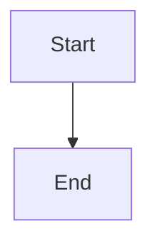

<objective>
Close two major UAT gaps from Phase 3 testing:
1. Mermaid diagrams silently fail to render because getBBox() returns zero dimensions inside
   WebView2's overflow:hidden flex body. Fix by giving mermaid.render() an off-screen container
   with real pixel dimensions.
2. Ctrl+=/- zoom hotkeys are intercepted by Notepad++ before reaching WebView2 because Scintilla
   retains keyboard focus. Fix by registering them as NPP plugin FuncItem shortcuts that call
   PreviewPanel zoom methods directly, bypassing the focus requirement.

Purpose: Restore the two major failing UAT tests (4 and 7) and unblock the two dependent skipped
tests (8 and 11) and the downstream PDF corruption (test 9).

Output: Updated preview.html (Mermaid), updated PluginDefinition.h/.cpp (NB_FUNC + FuncItems),
updated PreviewPanel.h/.cpp (public zoom methods + neutralized AcceleratorKeyPressed zoom).
</objective>

<execution_context>
@C:/Users/barnardh/source/repos/MarkdownPreview/.claude/get-shit-done/workflows/execute-plan.md
@C:/Users/barnardh/source/repos/MarkdownPreview/.claude/get-shit-done/templates/summary.md
</execution_context>

<context>
@.planning/PROJECT.md
@.planning/ROADMAP.md

<!-- Gap source -->
@.planning/phases/03-extended-rendering/03-HUMAN-UAT.md
</context>

<interfaces>
<!-- Key signatures the executor needs — no codebase exploration required. -->

From MarkdownPreview/src/PreviewPanel.h (relevant public/private members):
  private:
    float m_zoomLevel = 1.0f;           // current zoom, 0.8..8.0
    bool  m_printToPdfInProgress = false;
    EventRegistrationToken m_accelKeyToken = {};
    void postZoomToJs(float level);     // posts {type:"zoom", level:N} to WebView2

From MarkdownPreview/src/PreviewPanel.cpp:
  void PreviewPanel::postZoomToJs(float level) — posts zoom JSON to WebView2
  void PreviewPanel::applyInitialZoom(float level) — sets m_zoomLevel + postZoomToJs

From MarkdownPreview/src/PluginDefinition.h (current state):
  const int NB_FUNC = 3;   // must become 5
  extern FuncItem funcItems[NB_FUNC];

From MarkdownPreview/src/PluginDefinition.cpp commandMenuInit() (current items 0-2):
  funcItems[0] — Toggle Preview  (Ctrl+Shift+M)
  funcItems[1] — Export as HTML  (Ctrl+Shift+E)
  funcItems[2] — Export as PDF   (Ctrl+Shift+P)
  // Items 3 and 4 are new: Zoom In, Zoom Out

From MarkdownPreview/assets/preview.html renderMermaidDiagrams() (lines 437-468):
  _mermaid.render(id, source)              // current — no container arg
    .then(function(result) { ... })
    .catch(function() { /* silent */ });
  // Fix: create off-screen div, pass as third arg to _mermaid.render(id, source, container)
</interfaces>

<tasks>

<task type="auto">
  <name>Task 1: Fix Mermaid getBBox layout failure with off-screen render container</name>
  <files>MarkdownPreview/assets/preview.html</files>
  <action>
In the renderMermaidDiagrams() function (lines 437-468), make the following targeted changes:

1. Before the forEach loop, create a persistent off-screen container and attach it to the body ONCE:

```javascript
// Off-screen container gives getBBox() a real layout context (non-zero pixel dimensions).
// Mermaid's calculateTextDimensions appends a temp SVG to this container for measurement.
// position:absolute + left:-9999px removes it from the visible viewport.
// width:800px, height:600px ensures non-zero dimensions so getBBox() succeeds.
// visibility:hidden prevents any flash if a diagram takes time to render.
var offscreenContainer = document.createElement('div');
offscreenContainer.style.cssText = 'position:absolute;left:-9999px;top:0;width:800px;height:600px;visibility:hidden;overflow:hidden;';
document.body.appendChild(offscreenContainer);
```

2. Change the _mermaid.render() call to pass the container as the third argument:

```javascript
// Before (line 452):
_mermaid.render(id, source).then(function(result) {

// After:
_mermaid.render(id, source, offscreenContainer).then(function(result) {
```

3. After the forEach completes (after the closing `});` of the forEach), remove the off-screen
   container so it does not persist into PDF exports:

```javascript
// Clean up: remove the off-screen container after all render() Promises are dispatched.
// The container must remain in DOM until render() resolves (Promise is async).
// Use Promise.allSettled pattern: collect the render promises and remove container after all settle.
```

IMPORTANT — rewrite the entire renderMermaidDiagrams() function to use Promise.allSettled so the
cleanup is safe. Here is the complete replacement for the function body (lines 437-468):

```javascript
function renderMermaidDiagrams() {
    if (!_mermaid) return;

    var mermaidBlocks = document.querySelectorAll('code.language-mermaid');
    if (mermaidBlocks.length === 0) return;

    // Off-screen container gives getBBox() a real layout context (non-zero pixel dimensions).
    // Mermaid's calculateTextDimensions appends a temp SVG here for measurement.
    // position:absolute + left:-9999px removes it from the visible viewport.
    // width/height non-zero so getBBox() does not return {width:0, height:0}.
    // visibility:hidden prevents any flash; overflow:hidden clips stray content.
    var offscreenContainer = document.createElement('div');
    offscreenContainer.style.cssText =
        'position:absolute;left:-9999px;top:0;' +
        'width:800px;height:600px;' +
        'visibility:hidden;overflow:hidden;';
    document.body.appendChild(offscreenContainer);

    var renderPromises = [];

    mermaidBlocks.forEach(function(codeEl, index) {
        var pre = codeEl.parentElement;
        // codeEl.textContent gives raw text (hljs adds <span> nodes but textContent strips them)
        var source = codeEl.textContent || '';

        // Create a unique ID for mermaid.render()
        var id = 'mermaid-diagram-' + index + '-' + Date.now();

        // D-01: Use mermaid.render() per diagram with catch.
        // mermaid.run() does not reject per-diagram errors — it inserts an error SVG.
        // mermaid.render() returns a Promise; we catch per diagram to implement D-01.
        // Third argument is the off-screen container, giving getBBox() a real layout context.
        var p = _mermaid.render(id, source, offscreenContainer).then(function(result) {
            // WR-01: Use DOMParser to avoid unsanitized innerHTML SVG injection.
            // DOMParser parses in a sandboxed context; script removal adds defence-in-depth.
            var parser = new DOMParser();
            var svgDoc = parser.parseFromString(result.svg, 'image/svg+xml');
            svgDoc.querySelectorAll('script').forEach(function(s) { s.remove(); });
            var container = document.createElement('div');
            container.className = 'mermaid-diagram';
            container.appendChild(document.importNode(svgDoc.documentElement, true));
            pre.parentNode.replaceChild(container, pre);
        }).catch(function() {
            // D-01 fallback: show syntax-highlighted code block instead of error SVG
            // The <pre><code class="language-mermaid"> is already in the DOM from hljs;
            // just leave it in place (no DOM change needed on failure).
        });

        renderPromises.push(p);
    });

    // Remove the off-screen container after all render() Promises settle (success or failure).
    // allSettled (not all) ensures cleanup even when some diagrams fail D-01 fallback.
    Promise.allSettled(renderPromises).then(function() {
        if (offscreenContainer.parentNode) {
            offscreenContainer.parentNode.removeChild(offscreenContainer);
        }
    });
}
```

Replace the existing function at lines 437-469 with this exact replacement. Do NOT change any
other part of preview.html.
  </action>
  <verify>
Open Notepad++ with a .md file containing:



The preview panel should show a rendered SVG flowchart (not a code block). Also open a .md file
with invalid Mermaid syntax and confirm it falls back to a code block.

Build the solution first: `msbuild MarkdownPreview.sln /p:Configuration=Debug /p:Platform=x64`
should succeed with zero errors (this is a JS-only change so no C++ compilation errors expected,
but confirm the solution still builds cleanly).
  </verify>
  <done>
- Valid Mermaid block renders as SVG diagram in the preview panel (not as a code block)
- Invalid Mermaid block falls back to highlighted code (not an error SVG)
- PDF export of a document with a valid Mermaid block contains no "Syntax error" text
- Off-screen container is not present in the DOM after rendering completes
  </done>
</task>

<task type="auto">
  <name>Task 2: Register Ctrl+=/- as NPP plugin shortcuts that call PreviewPanel zoom methods</name>
  <files>
    MarkdownPreview/src/PreviewPanel.h,
    MarkdownPreview/src/PreviewPanel.cpp,
    MarkdownPreview/src/PluginDefinition.h,
    MarkdownPreview/src/PluginDefinition.cpp
  </files>
  <action>
The root cause is that AcceleratorKeyPressed only fires when WebView2 has keyboard focus, but
Scintilla always retains focus in normal use. The fix registers Ctrl+= and Ctrl+- as NPP plugin
FuncItem shortcuts, which fire regardless of focus.

**Step A — PreviewPanel.h: add public zoomIn() and zoomOut() declarations**

In the `public:` section of the PreviewPanel class (after the existing public method declarations),
add:

```cpp
void zoomIn();   // Ctrl+= handler: increase zoom by 10%, clamp at 800%
void zoomOut();  // Ctrl+- handler: decrease zoom by 10%, clamp at 80%
```

These are called from the new PluginDefinition.cpp menu callbacks.

**Step B — PreviewPanel.cpp: implement zoomIn() and zoomOut()**

Add the two method implementations after the existing applyInitialZoom() / postZoomToJs() block
(around line 577, after postZoomToJs). Add:

```cpp
// Phase 3 Gap: zoomIn / zoomOut called from NPP plugin FuncItem shortcuts.
// These fire regardless of keyboard focus (unlike AcceleratorKeyPressed).
// Zoom step, clamp values, and persistence mirror AcceleratorKeyPressed handler (D-04, D-05).
void PreviewPanel::zoomIn() {
    const float step    = 0.1f;
    const float maxZoom = 8.0f;
    if (m_printToPdfInProgress) return;  // WR-02: guard same as AcceleratorKeyPressed
    m_zoomLevel = min(maxZoom, m_zoomLevel + step);
    g_settings.zoomLevel = m_zoomLevel;
    if (!m_configPath.empty()) {
        g_settings.save(m_configPath);
    }
    postZoomToJs(m_zoomLevel);
}

void PreviewPanel::zoomOut() {
    const float step    = 0.1f;
    const float minZoom = 0.8f;
    if (m_printToPdfInProgress) return;  // WR-02: guard same as AcceleratorKeyPressed
    m_zoomLevel = max(minZoom, m_zoomLevel - step);
    g_settings.zoomLevel = m_zoomLevel;
    if (!m_configPath.empty()) {
        g_settings.save(m_configPath);
    }
    postZoomToJs(m_zoomLevel);
}
```

Note: `g_settings` and `min`/`max` are already available in this translation unit.

**Step C — PreviewPanel.cpp: neutralize the AcceleratorKeyPressed zoom handling**

In the AcceleratorKeyPressed callback (lines 238-301), the zoom logic currently runs when
Ctrl+ OEM_PLUS / OEM_MINUS / 0x30 is pressed. After registering them as FuncItems, this handler
is redundant and would cause double-zoom if WebView2 happens to have focus.

Find the block beginning with:
```cpp
bool isZoomKey = (vk == VK_OEM_PLUS || vk == VK_OEM_MINUS || vk == 0x30);
if (!isZoomKey) return S_OK;
```

Change it to return early without applying zoom — keep the `put_Handled(TRUE)` call so WebView2's
built-in Ctrl+/- browser zoom is still suppressed, but skip the custom zoom logic:

```cpp
bool isZoomKey = (vk == VK_OEM_PLUS || vk == VK_OEM_MINUS || vk == 0x30);
if (!isZoomKey) return S_OK;

// Suppress WebView2 built-in zoom behavior regardless of focus state.
args->put_Handled(TRUE);

// Phase 3 Gap: zoom is now handled via NPP plugin FuncItem shortcuts (zoomIn/zoomOut)
// which fire regardless of keyboard focus. Do not apply zoom here to avoid double-zoom
// if WebView2 happens to have focus while the user presses Ctrl+=/-.
return S_OK;
```

Remove or comment out all the zoom computation and postZoomToJs call that follows that guard.
Keep everything before isZoomKey (the kind check, the vk check, the ctrlDown check) unchanged.

**Step D — PluginDefinition.h: increase NB_FUNC from 3 to 5**

Change line 11:
```cpp
// Before:
const int NB_FUNC = 3;  // Toggle Preview + Export as HTML + Export as PDF

// After:
const int NB_FUNC = 5;  // Toggle Preview + Export as HTML + Export as PDF + Zoom In + Zoom Out
```

**Step E — PluginDefinition.cpp: add ShortcutKey structs and register FuncItems 3 and 4**

After the existing `pdfExportShortcut` declaration (line 36), add:

```cpp
// Shortcut key: Ctrl+= for Zoom In (preview panel)
// VK_OEM_PLUS is the = key on US keyboards; Ctrl+= is the conventional zoom-in chord.
// Not a default Notepad++ shortcut.
static ShortcutKey zoomInShortcut  = { true, false, false, VK_OEM_PLUS };

// Shortcut key: Ctrl+- for Zoom Out (preview panel)
// VK_OEM_MINUS is the - key; Ctrl+- is the conventional zoom-out chord.
// Not a default Notepad++ shortcut.
static ShortcutKey zoomOutShortcut = { true, false, false, VK_OEM_MINUS };
```

Then at the bottom of commandMenuInit() (after funcItems[2] registration, line 74), add:

```cpp
// Menu item 3: Zoom In (Ctrl+=) — calls PreviewPanel::zoomIn() regardless of focus
wcscpy_s(funcItems[3]._itemName, menuItemSize, L"Zoom In Preview");
funcItems[3]._pFunc  = zoomInPreview;
funcItems[3]._cmdID  = 0;
funcItems[3]._init2Check = false;
funcItems[3]._pShKey = &zoomInShortcut;

// Menu item 4: Zoom Out (Ctrl+-) — calls PreviewPanel::zoomOut() regardless of focus
wcscpy_s(funcItems[4]._itemName, menuItemSize, L"Zoom Out Preview");
funcItems[4]._pFunc  = zoomOutPreview;
funcItems[4]._cmdID  = 0;
funcItems[4]._init2Check = false;
funcItems[4]._pShKey = &zoomOutShortcut;
```

Add the two callback function declarations in PluginDefinition.h (in the "Menu commands" section):

```cpp
void zoomInPreview();   // menu command: increase preview zoom by 10%
void zoomOutPreview();  // menu command: decrease preview zoom by 10%
```

Add the two callback function implementations in PluginDefinition.cpp (after exportMarkdownAsPdf()):

```cpp
void zoomInPreview() {
    g_previewPanel.zoomIn();
}

void zoomOutPreview() {
    g_previewPanel.zoomOut();
}
```

**Step F — Build and confirm**

Build with:
```
msbuild MarkdownPreview.sln /p:Configuration=Debug /p:Platform=x64
```

Fix any compilation errors before considering this task done. Common issues to watch for:
- `VK_OEM_PLUS` / `VK_OEM_MINUS` are defined in `<winuser.h>` via `<windows.h>`, already included.
- `min` / `max` — if NOMINMAX is defined, use `std::min` / `std::max` and include `<algorithm>`.
  </action>
  <verify>
1. Build succeeds with zero errors: `msbuild MarkdownPreview.sln /p:Configuration=Debug /p:Platform=x64`
2. Install the Debug DLL into the Notepad++ plugins folder.
3. Open Notepad++ with a .md file. Confirm the editor (Scintilla) has focus (click the editor text area).
4. Press Ctrl+= — the preview panel text grows visibly.
5. Press Ctrl+- — the preview panel text shrinks visibly.
6. Press Ctrl+0 (this still uses Scintilla's Ctrl+0 reset — NOT expected to zoom preview; only Ctrl+= and Ctrl+- are new. Ctrl+0 in editor context zooms the editor. Zoom reset of the preview is out of scope for this gap — the existing AcceleratorKeyPressed Ctrl+0 only fires when WebView2 has focus.)
7. Confirm Ctrl+= at 800% zoom does not increase further (clamped).
8. Confirm Ctrl+- at 80% zoom does not decrease further (clamped).
9. Restart Notepad++ and confirm the zoom level is preserved (settings.json persistence).
  </verify>
  <done>
- Build compiles cleanly with NB_FUNC = 5 and two new FuncItem entries
- Ctrl+= increases preview zoom while Scintilla has focus (editor is active)
- Ctrl+- decreases preview zoom while Scintilla has focus (editor is active)
- Zoom is clamped at 80% and 800%
- Zoom level persists across Notepad++ restart
- No double-zoom occurs when WebView2 happens to have focus (AcceleratorKeyPressed zoom neutralized)
  </done>
</task>

</tasks>

<threat_model>
## Trust Boundaries

| Boundary | Description |
|----------|-------------|
| WebView2 JS → C++ (PostWebMessage) | Messages from the web page reach C++ via PostWebMessageAsJson |
| C++ → WebView2 JS (ExecuteScript) | C++ sends JSON to JS dispatcher |
| Mermaid SVG → DOM | SVG text from Mermaid library inserted into the preview DOM |

## STRIDE Threat Register

| Threat ID | Category | Component | Disposition | Mitigation Plan |
|-----------|----------|-----------|-------------|-----------------|
| T-03G-01 | Tampering | Mermaid SVG inserted into DOM | mitigate | WR-01 (already present): DOMParser + querySelectorAll('script').remove() strips script nodes before DOM insertion. Off-screen container does not weaken this — SVG is still parsed via DOMParser, not innerHTML. |
| T-03G-02 | Elevation of Privilege | Off-screen container persists in DOM | mitigate | Promise.allSettled cleanup removes the container after all renders settle. Container has visibility:hidden and overflow:hidden — no user-visible surface. |
| T-03G-03 | Denial of Service | zoomIn/zoomOut called rapidly from shortcut key repeat | accept | Key repeat rate is hardware-limited; postZoomToJs posts a JSON message which is async and cheap. m_printToPdfInProgress guard already blocks during PDF export. No rate limiting needed at this volume. |
| T-03G-04 | Tampering | FuncItem shortcut conflicts with Notepad++ built-in | accept | Ctrl+= and Ctrl+- are not default Notepad++ shortcuts (verified against NPP default shortcut list). NPP plugin FuncItem registration wins over editor default handling when registered. |
</threat_model>

<verification>
After both tasks are complete, verify the following end-to-end scenarios:

1. Open a .md file with a valid Mermaid block. Preview shows SVG diagram. (UAT test 4)
2. Open a .md file with invalid Mermaid syntax. Preview shows highlighted code block, no error SVG. (UAT test 5 regression check)
3. Export the Mermaid document as PDF. The PDF contains the rendered diagram, no "Syntax error" text. (UAT test 9)
4. With Scintilla focused, press Ctrl+= three times. Preview zoom increases by 30%. (UAT test 7)
5. With Scintilla focused, press Ctrl+- three times. Preview zoom decreases by 30%. (UAT test 7)
6. Restart Notepad++. Zoom level is preserved. (UAT test 8)
7. Build: `msbuild MarkdownPreview.sln /p:Configuration=Release /p:Platform=x64` succeeds with zero errors.
</verification>

<success_criteria>
- UAT test 4 (Mermaid SVG): pass
- UAT test 7 (Ctrl+=/- zoom): pass
- UAT test 9 (clean PDF): pass (side-effect of test 4 fix)
- UAT test 8 (zoom persistence): unblocked and passing
- No regression on UAT tests 1, 2, 3, 5, 6, 10
- Release build succeeds with zero errors and zero new warnings
</success_criteria>

<output>
After completion, create `.planning/phases/03-extended-rendering/03-GAP-SUMMARY.md` using the
standard summary template at `.claude/get-shit-done/templates/summary.md`.
</output>
```
